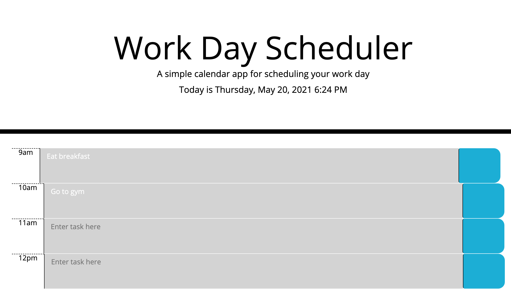

# hw5-work-day-scheduler
Third-Party APIs

## Elevator Pitch
---
Created a work day scheduler that allows user to enter tasks and store them locally

## Application
---
* User can enter tasks in desired time blocks
* When user clicks "save", task will be stored locally

## Future Improvements
---
Clean up styling 